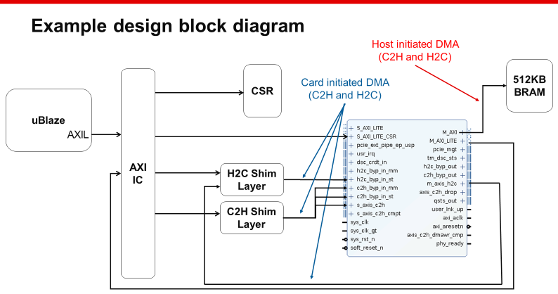
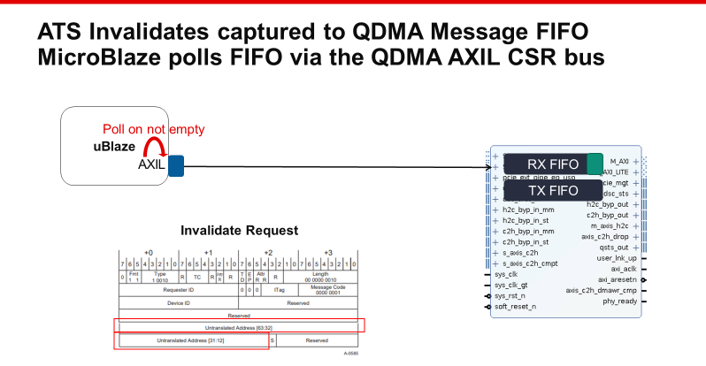
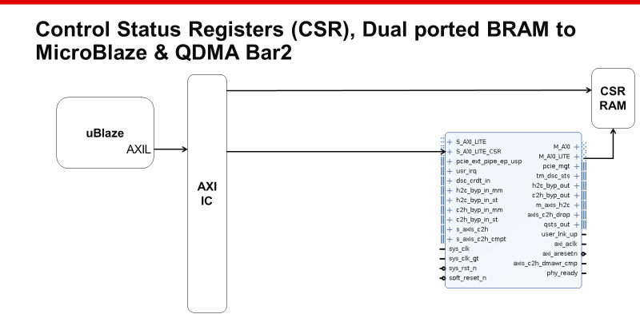
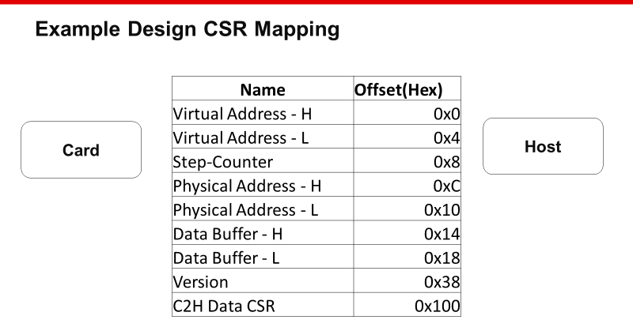
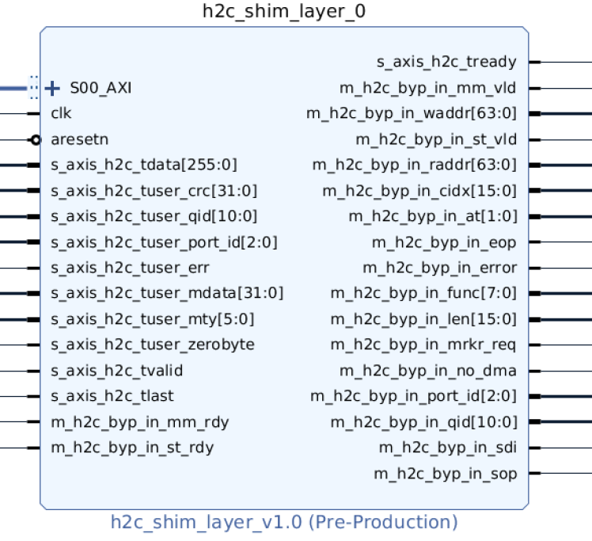
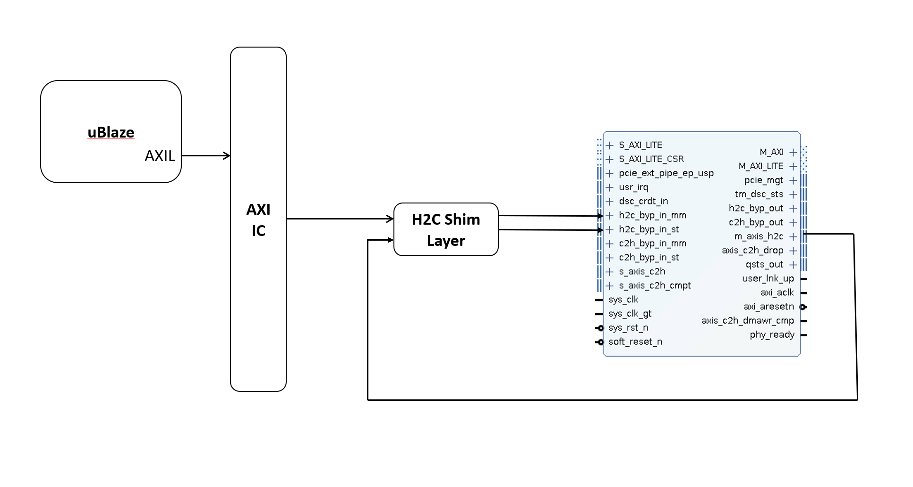
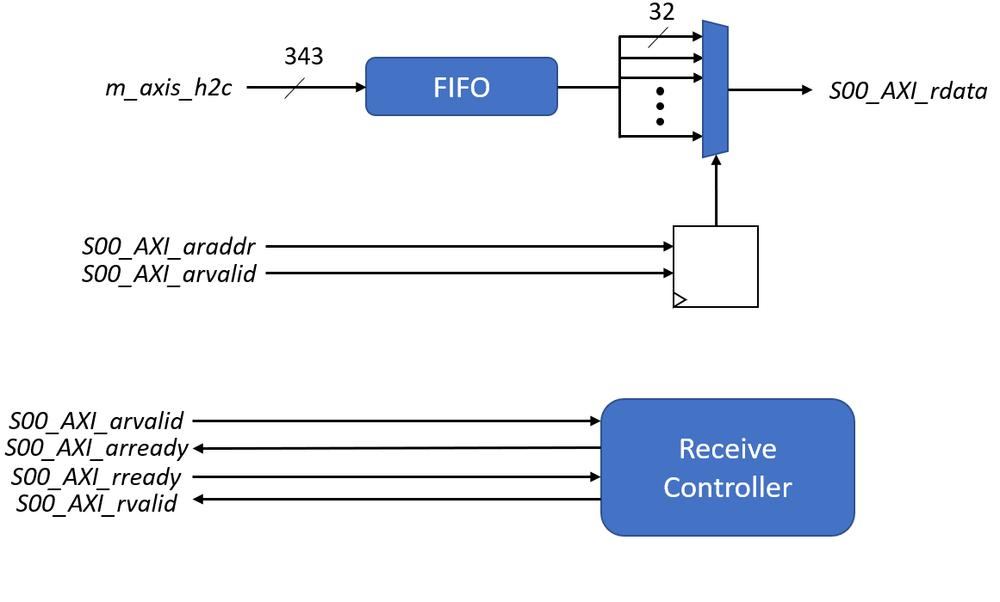
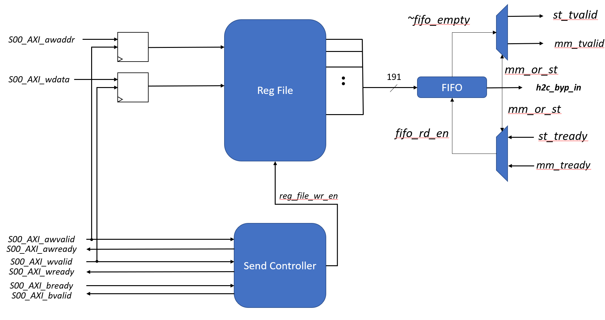
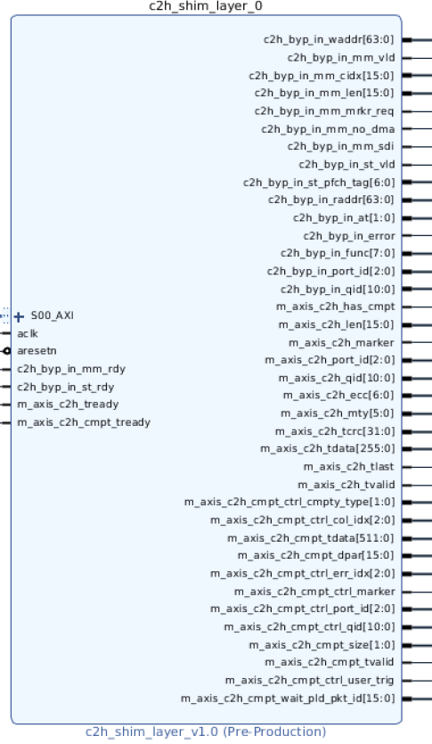
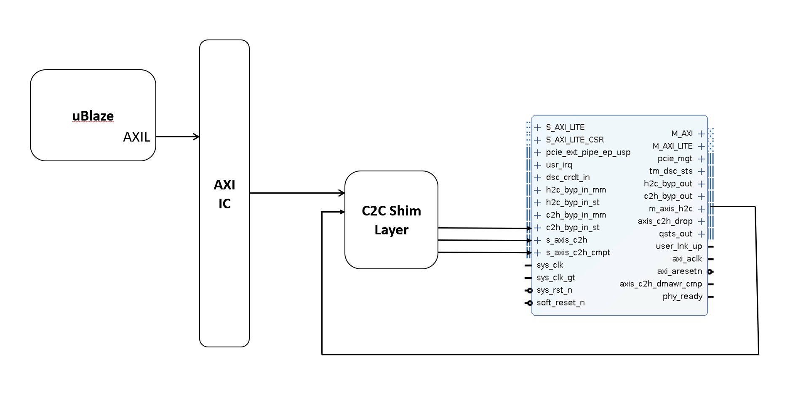

# PCIe ATS using Xilinx QDMA
## Example Design Kit Users Guide

### Introduction
This document and the example design, software, simulations, and system hardware test cases described were created to assist the user to become familiar with PCI Express basic Address Translation Services extensions support within the Xilinx FPGA design space.  The example design, Queue Direct Memory Access (QDMA) subsystem, MicroBlaze™ processor subsystem, Host system software and simulation test bench described in this document is limited to those transactions associated with the PCI Express Address Translation Services (ATS) extensions.  The Xilinx Virtex UltraScale+™ QDMA subsystem, was chosen because it provides comprehensive support for PCI Express DMA and the best level of support PCI Express ATS extensions.  The QDMA subsystem is a PCI Express® (PCIe ®) based DMA engine that is optimized for both high bandwidth and high packet count data transfers. The QDMA is composed of the UltraScale+™ integrated block for PCI Express IP, and an extensive DMA and bridge infrastructure.  This document is concerned with those QDMA features and use cases that would be necessary to facilitate transactions that utilize the PCIe ATS extensions. The example design also utilized the streaming bypass interfaces to illustrate the PCIe ATS extensions.  The full documentation for the Xilinx QDMA subsystem can be found at: 

https://www.xilinx.com/support/documentation/ip_documentation/qdma/v4_0/pg302-qdma.pdf 

### Example Design Concept, Use and Operation

The Xilinx hardware platform selected is the Xilinx® Alveo™ U280 Data Center accelerator card. This PCIe card is a full height, dual slot, ¾ length (passive cooling) or full length (active cooling) form factor.  

https://www.xilinx.com/products/boards-and-kits/alveo/u280.html   The example design was created using the Xilinx IP Integrator design tool.  As stated in the introduction, the example design was created to introduce the designer to several of the methods to exercise the PCIe ATS transactions.  The main parts of the FPGA design consist of the Queue Direct Memory Access (QDMA) subsystem, MicroBlaze™ processor subsystem, the host to card bypass interface “shim”(h2c shim), the card to host bypass interface “shim” (c2h shim), the Command Status Register block RAM (CSR BRAM), memory mapped AXI4 interface 512KB Block RAM (BRAM) and the AXI Lite UART for MicroBlaze™ program status.  The Queue Direct Memory Access (QDMA) subsystem has embedded in it the Xilinx PCIe interface and the Xilinx GTH type multi-Gigabit transceiver PCIe PHY to facilitate a Gen 3 x 8 link lanes.  Although the QDMA / PCIe support several PCIe link rates and bus widths, the example design is preset and fixed to be Gen3 x8. The QDMA has the capability of utilizing queues to facilitates the DMA transfers, and although the queue functionality is available to the example design and are supported operations via the Xilinx reference design host drivers, these are not part of the example design example test cases.  The example design uses the streaming bypass interfaces at this time and have MicroBlaze™ embedded drivers with descriptors for the bypass QDMA mode for transfers that will be described in more detail when discussing the demo tests. 
The example design and tests were created to demonstrate the following list of basic ATS tasks:

1.	Advertise ATS capability in the QDMA PCIe extended config space.
2.	Receive and correctly complete ATS invalidate message requests.
3.	Read and process Host written data and commands from the QDMA BAR 2.
4.	Preform un-translated (virtual memory) addressed reads and writes using the streaming QDMA bypass H2C and C2H interfaces.
5.	Create address translation requests to the Host, and process the request’s completions.
6.	Preform translated (physical memory) addressed reads and writes using the streaming QDMA bypass H2C and C2H interfaces
 

The example design “card side” operation is managed by a 32 bit Xilinx MicroBlaze™  processor. The MicroBlaze™ processor interfaces with the QDMA subsystem block’s s_axil_csr bus,  CSR BRAM, the H2C shim interface, the C2H shim interface and the UART lite (axi_lite bus).  The example design block diagram shows the MicroBlaze™ processor axi_lite bus interfaces to the previously mentioned interfaces via the Xilinx Smart connect axi interconnect block. The 2 shim interfaces contain input and output FIFOs to receive and output streaming data and QDMA descriptors to the QDMA bypass streaming interfaces.  The CSR BRAM is memory mapped to store MicroBlaze™ control loop commands, status, version and address information, stored by both the host and card side operation.  (see the partial list of CSR address map Fig. #x)  The stored address information can be used to form descriptors sent to the QDMA subsystem block via the shim interfaces.   The processor’s control loop defaults to polling the QDMA subsystem block’s PCIe receive message FIFO via the QDMA subsystem block’s s_axil_csr bus. The loop will also check for host commands via the “step_counter” status. The QDMA message FIFO will capture all PCIe message types and the MicroBlaze™ in turn process each message.  When a PCIe ATS invalidate message is found in the message FIFO the MicroBlaze will create the correct ATS invalidate completion message and push it onto the transmit side of the QDMA message FIFO, which will generate the appropriate PCIe transmit message TLP. 
The QDMA subsystem block is configured for the PCIe BAR 2 to be memory mapped to the m_axi_lite bus. There is a Block Ram (BRAM) mapped to the QDMA’s m_axi_lite bus.  The BRAM is dual ported so that both the MicroBlaze and the host via the BAR2 AXI bus can both read and write the BRAM storage. We have labeled this memory as CSR memory (Command and Status Register) storage. This arrangement allows the host to read and write the CSR BRAM to pass addresses information and to initiate commands on the card.  The host can monitor the current state of the MicroBlaze’s main control loop as well as issue commands by writing the step counter a new value.  The CSR BRAM is also mapped to allow the host to read and write the virtual and physical 64 bit addresses mapped to the CSR.  Please note the data width for the CSR BRAM is 32 to bits as well as the MicroBlaze AXI buses and the 64 bit addressing is stored as 32 bit Dwords on consecutive address in the CSR registers.  

 

 

 

## The H2C Shim:
This block is used to allow the MicroBlaze™ to interface with the QDMA core for card-initiated H2C-ST and H2C-MM DMAs. This is necessary as the MicroBlaze™ has AXI-MM and AXI-Lite interfaces, since there is not an existing Xilinx IP which can convert between those protocols and AXI-Stream to the bit widths necessary to interface with the QDMA H2C descriptor bypass on the QDMA core. Therefore, this IP was created to allow the MicroBlaze™ to communicate with both the `h2c_byp_in_st`, `h2c_byp_in_mm`, and `m_axis_h2c` ports on the QDMA using an AXI-Lite interface.  Below is the graphical depiction of this IP and at a high-level how it is integrated into the system.  In the receive path, the QDMA core will output the result of a DMA operation on the `m_axis_h2c` bus. This will first be stored in a first-word fall through FIFO. The `ready` signal on the `m_axis_h2c` bus is connected to `~fifo_full` to process the valid-ready handshake on the streaming bus. Then, the output of the FIFO is split into 32-bit chunks which go into a large MUX which is indexed by the `araddr` signal the MicroBlaze sends over the AXI-Lite interface. This way, using a memory map the MicroBlaze will be able to read 32-bit chunks from the FIFO. This memory map is defined later in the documentation. An FSM called `receive_controller` handles the handshake protocol for the AXI-Lite bus. When the MicroBlaze is done reading, it will write to a bit in the memory map to pop the value from the FIFO and it will read the next value. There is a bit in the read memory map to check if the FIFO is empty or not, which the microblaze can poll on to determine if a DMA result is available. A graphical depiction of the recieve path can be seen below.  In the send path, the MicroBlaze will write a descriptor in 32-bit chunks which will eventually be sent into the `h2c_byp_in_st` or `h2c_byp_in_mm` bus on the QDMA core, depending on the `mm_or_st` field. For this, the MicroBlaze uses the AXI-Lite interface to write to a register file containing the data that will be in the descriptor. Similarly, for the receive path, there is an FSM called `send_controller` which handles all of the AXI-Lite handshakes on the write data, write address, and write response channels. All outputs of the register file are concatenated together and sent to one large first-word fall through FIFO. When the MicroBlaze is done writing data, it can write to a bit in the memory map which will push all the contents of the register file into the FIFO. The valid signals of `h2c_byp_in_st` and `h2c_byp_in_mm` are connected to a de-mux selected by the outcoming `mm_or_st` from the FIFO. This will determine which interface the descriptor is sent on.  Similarly, `h2c_byp_in_st` and `h2c_byp_in_mm` go into a MUX which is selected by the same `mm_or_st` selector bit.  The output of the MUX is the ready signal of the interface we are using and goes to the `rd_en` bit of the FIFO. A graphical depiction of the send path can be seen below.

This layer is used to allow the microblaze to interface with the QDMA core for card-initiated H2C-ST and H2C-MM DMAs. This is necessary as the MicroBlaze has AXI-MM and AXI-Lite interfaces, but to the best of our knowledge there is not an IP which can convert between those protocols and AXI-Stream to the bitwidths necessary to interface with the QDMA H2C descriptor bypass on the QDMA core. Therefore, this IP was created to allow the MicroBlaze to communicate with both the `h2c_byp_in_st`, `h2c_byp_in_mm`, and `m_axis_h2c` ports on the QDMA using an AXI-Lite interface. Below is the graphical depiction of this IP and at a high-level how it is integrated into the system: 

### Receive Path
In the receive path, the QDMA core will output the result of a DMA operation on the `m_axis_h2c` bus. This will first be stored in a first-word fall through FIFO. The `ready` signal on the `m_axis_h2c` bus is connected to `~fifo_full` to process the valid-ready handshake on the streaming bus. Then, the output of the FIFO is split into 32-bit chunks which go into a large MUX which is indexed by the `araddr` signal the MicroBlaze sends over the AXI-Lite interface. This way, using a memory map the MicroBlaze will be able to read 32-bit chunks from the FIFO. This memory map is defined later in the documentation. An FSM called `receive_controller` handles the handshake protocol for the AXI-Lite bus. When the MicroBlaze is done reading, it will write to a bit in the memory map to pop the value from the FIFO and it will read the next value. There is a bit in the read memory map to check if the FIFO is empty or not, which the microblaze can poll on to determine if a DMA result is avaiable. A graphical depiction of the recieve path can be seen below:

### Send Path
In the send path, the MicroBlaze will write a descriptor in 32-bit chunks which will eventually be sent into the `h2c_byp_in_st` or `h2c_byp_in_mm` bus on the QDMA core, depending on the `mm_or_st` field. For this, the MicroBlaze uses the AXI-Lite interface to write to a register file containing the data that will be in the descriptor. Similarly to the recieve path, there is an FSM called `send_controller` which handles all of the AXI-Lite handshakes on the write data, write address, and write response channels. All output of the register file are concatenated together and sent to one large first-word fall through FIFO. When the MicroBlaze is done writing data, it can write to a bit in the memory map which will push all of the contents of the register file into the FIFO. The valid signals of `h2c_byp_in_st` and `h2c_byp_in_mm` are connected to a demux selected by the outcoming `mm_or_st` from the FIFO. This will determine which inteface the descriptor is sent on. Similarly, `h2c_byp_in_st` and `h2c_byp_in_mm` go into a MUX which is selected by the same `mm_or_st`. The output of the MUX is the ready signal of the interface we are using, and goes to the `rd_en` bit of the FIFO. A graphical depiction of the send path can be seen below:

##### H2C Read memory address map:

| Address     | Bit(s)      | Data                       |
| ----------- | ----------- | --------------------------|
| 0x00        | [31:0]      | m_axis_h2c_tdata[255:224]  |
| 0x04        | [31:0]      | m_axis_h2c_tdata[223:192]  |
| 0x08        | [31:0]      | m_axis_h2c_tdata[191:160]  |
| 0x0C        | [31:0]      | m_axis_h2c_tdata[159:128]  |
| 0x10        | [31:0]      | m_axis_h2c_tdata[127:96]   |
| 0x04        | [31:0]      | m_axis_h2c_tdata[95:64]    |
| 0x18        | [31:0]      | m_axis_h2c_tdata[63:32]    |
| 0x1C        | [31:0]      | m_axis_h2c_tdata[31:0]     |
| 0x20        | [31:0]      | m_axis_h2c_tuser_crc       |
| 0x24        | [31:24]     | RESERVED                   |
|             | [23]        | in_fifo_not_empty          |
|             | [22:12]     | m_axis_h2c_tuser_qid       |
|             | [11:9]      | m_axis_h2c_tuser_port_id   |
|             | [8]         | m_axis_h2c_tuser_err       |
|             | [7:2]       | m_axis_h2c_tuser_mty       |
|             | [1]         | m_axis_h2c_tuser_zerobyte  |
|             | [0]         | m_axis_h2c_tuser_tlast     |
| 0x28        | [31:0]      | m_axis_h2c_tuser_mdata     |
| 0x2C        | [31:0]      | m_axis_h2c_tdata[39:32]    |
|             |             | [47:40] [55:52] 12h000     |
| 0x30        | [31:0]      | m_axis_h2c_tdata[7:0]      |
|             |             | [15:8] [23:16] [31:24]     |
| 0x34        | [31:0]      | see note below             |

Note:  * Address 0x2c = un-swizzled low order 32 bits of a translated address,  Address 0x30 = un-swizzled  high order 32 bits of a translated address,  Address 0x34  un-swizzled and packed 5 bits  of a translated address data field  bits 4:0 = S, N, U, W, R   

##### H2C Write memory address map:  

| Address     | Bit(s)      | Data                       |
| ----------- | ----------- | --------------------------|
| 0x00        | [31:0]      | h2c_byp_in_raddr[63:32]    |
| 0x04        | [31:0]      | h2c_byp_in_raddr[63:0]     |
| 0x08        | [31:0]      | h2c_byp_in_waddr[63:0]     |
| 0x0C        | [31:0]      | h2c_byp_in_waddr[63:0]     |
| 0x10        | [31:24]     | h2c_byp_in_func            |
|             | [23]        | h2c_byp_in_error           |
|             | [22]        | h2c_byp_in_no_dma          |
|             | [21]        | h2c_byp_in_mrkr_req        |
|             | [20]        | h2c_byp_in_sdi             |
|             | [19]        | h2c_byp_in_eop             |
|             | [18]        | h2c_byp_in_sop             |
|             | [17:16]     | h2c_byp_in_at              |
|             | [15:0]      | h2c_byp_in_len             |
| 0x14        | [31]        | RESERVED                   |
|             | [30]        | h2c_byp_in_mm_or_st        |
|             | [29:14]     | h2c_byp_in_cidx            |
|             | [13:11]     | h2c_byp_in_port_id         |
|             | [10:0]      | h2c_byp_in_qid             |
| 0x18        | [31:2]      | RESERVED                   |
|             | [1]         | push_out_fifo              |
|             | [0]         | pop_in_fifo                |

​      

## The C2H Shim:

This block is used to allow the MicrBlaze to interface with the QDMA core for card-initiated C2H-ST and C2H-MM DMAs. This shim is necessary as the MicroBlaze has AXI-MM and AXI-Lite interfaces, and since there is not an existing Xilinx IP which can convert between those protocols and AXI-Stream to the bit widths necessary to interface with the QDMA H2C descriptor bypass interfaces on the QDMA core. Therefore, this IP was created to allow the MicroBlaze to communicate with the `c2h_byp_in_st`, `c2h_byp_in_mm`, `s_axis_c2h`, `s_axis_c2h_cmpt`  ports on the QDMA using an AXI-Lite interface. Below is the graphical depiction of this IP and at a high-level how it is integrated into the system.  In the C2H shim layer there is no receive path as it is only sending data to the host. The send layer is very similar to that of the H2C shim layer except there are 4 ports to output to instead of 2. Please refer to the H2C shim layer to get more detail of how the microarchitecture of the send path works.

This layer is used to allow the microblaze to interface with the QDMA core for card-initiated C2H-ST and C2H-MM DMAs. This is necessary as the MicroBlaze has AXI-MM and AXI-Lite interfaces, but to the best of our knowledge there is not an IP which can convert between those protocols and AXI-Stream to the bitwidths necessary to interface with the QDMA H2C descriptor bypass on the QDMA core. Therefore, this IP was created to allow the MicroBlaze to communicate with the `c2h_byp_in_st`, `c2h_byp_in_mm`, `s_axis_c2h`, `s_axis_c2h_cmpt`  ports on the QDMA using an AXI-Lite interface. Below is the graphical depiction of this IP and at a high-level how it is integrated into the system: 

### C2H Write data path

##### C2H Write data memory map:

| Address     | Bit(s)      | Data                            |
| ----------- | ----------- | --------------------------------|
| 0x00        | [31:0]      | c2h_byp_in_raddr[63:32]         |
| 0x04        | [31:0]      | c2h_byp_in_raddr[63:0]          |
| 0x08        | [31:0]      | c2h_byp_in_waddr[63:0]          |
| 0x0C        | [31:0]      | c2h_byp_in_waddr[63:0]          |
| 0x10        | [31:21]     | c2h_byp_in_qid                  |
|             | [20:18]     | c2h_byp_in_port_id              |
|             | [17:11]     | c2h_byp_in_st_pfch_tag          |
|             | [10:3]      | c2h_byp_in_func                 |
|             | [2]         | c2h_byp_in_error                |
|             | [1:0]       | c2h_byp_in_at                   |
| 0x14        | [31:16]     | c2h_byp_in_mm_len               |
|             | [15:0]      | c2h_byp_in_mm_cidx              |
| 0x18        | [31:21]     | m_axis_c2h_has_cmpt             |
|             | [20:18]     | m_axis_c2h_port_id              |
|             | [17]        | m_axis_c2h_marker               |
|             | [16:1]      | m_axis_c2h_len                  |
|             | [0]         | m_axis_c2h_has_cmpt             |
| 0x1C        | [17]        | c2h_byp_in_mm_sdi               |
|             | [16]        | c2h_byp_in_mm_no_dma            |
|             | [15]        | c2h_byp_in_mm_mrkr_req          |
|             | [14]        | c2h_byp_in_mm_or_st             |
|             | [13]        | m_axis_c2h_tlast                |
|             | [12:7]      | m_axis_c2h_mty                  |
|             | [6:0]       | m_axis_c2h_ecc                  |
| 0x20        | [31:0]      | m_axis_c2h_tcrc                 |
| 0x24        | [31:0]      | m_axis_c2h_tdata[255:224]       |
| 0x28        | [31:0]      | m_axis_c2h_tdata[223:192]       |
| 0x2C        | [31:0]      | m_axis_c2h_tdata[191:160]       |
| 0x30        | [31:0]      | m_axis_c2h_tdata[159:128]       |
| 0x34        | [31:0]      | m_axis_c2h_tdata[127:96]        |
| 0x38        | [31:0]      | m_axis_c2h_tdata[95:64]         |
| 0x3C        | [31:0]      | m_axis_c2h_tdata[63:32]         |
| 0x40        | [31:0]      | m_axis_c2h_tdata[31:0]          |
| 0x44        | [30]        | m_axis_c2h_cmpt_ctrl_user_trig  |
|             | [29:28]     | m_axis_c2h_cmpt_size            |
|             | [27:25]     | m_axis_c2h_cmpt_port_id         |
|             | [24]        | m_axis_c2h_cmpt_marker          |
|             | [23:21]     | m_axis_c2h_cmpt_err_idx         |
|             | [20:5]      | m_axis_c2h_cmpt_dpar            |
|             | [4:2]       | m_axis_c2h_cmpt_col_idx         |
|             | [1:0]       | m_axis_c2h_cmpt_cmpt_type       |
| 0x48        | [26:11]     | m_axis_c2h_cmpt_wait_pld_pkt_id |
|             | [10:0]      | m_axis_c2h_cmpt_qid             |
| 0x4C        | [31:0]      | m_axis_c2h_cmpt_tdata[511:480]  |
| 0x50        | [31:0]      | m_axis_c2h_cmpt_tdata[479:448]  |
| 0x54        | [31:0]      | m_axis_c2h_cmpt_tdata[447:416]  |
| 0x58        | [31:0]      | m_axis_c2h_cmpt_tdata[415:384]  |
| 0x5C        | [31:0]      | m_axis_c2h_cmpt_tdata[383:352]  |
| 0x60        | [31:0]      | m_axis_c2h_cmpt_tdata[351:320]  |
| 0x64        | [31:0]      | m_axis_c2h_cmpt_tdata[319:288]  |
| 0x68        | [31:0]      | m_axis_c2h_cmpt_tdata[287:256]  |
| 0x6C        | [31:0]      | m_axis_c2h_cmpt_tdata[255:224]  |
| 0x70        | [31:0]      | m_axis_c2h_cmpt_tdata[223:192]  |
| 0x74        | [31:0]      | m_axis_c2h_cmpt_tdata[191:160]  |
| 0x78        | [31:0]      | m_axis_c2h_cmpt_tdata[159:128]  |
| 0x7C        | [31:0]      | m_axis_c2h_cmpt_tdata[127:96]   |
| 0x80        | [31:0]      | m_axis_c2h_cmpt_tdata[95:64]    |
| 0x84        | [31:0]      | m_axis_c2h_cmpt_tdata[63:32]    |
| 0x88        | [31:0]      | m_axis_c2h_cmpt_tdata[31:0]     |
| 0x8C        | [2]         | push_data_fifo                  |
|             | [1]         | push_cmpt_fifo                  |
|             | [0]         | push_desc_fifo                  |

## Functional Simulation 

The functional simulation environment is derived from an IP catalog QDMA IP “example design” project test bench.  The test bench utilizes the Xilinx PCIe Root Port simulation model pcie_4_c_rp.v, and modified versions of the sample_tests.vh, usp_pci_exp_usrapp_tx.v,  and usp_pci_exp_usrapp_rx.v RTL and system Verilog tasks used to stimulate the QDMA end point via the test bench root port. The rest of the IP catalog QDMA IP “example design” file set were un-modified. The diagram below shows the 5 main bus interfaces to the root port model. The usp_pci_exp_usrapp_tx.v RTL provides stimulus the root port input AXI streaming PCIe buses Requestor reQuests (RQ) and Completer Completions (CC).  The usp_pci_exp_usrapp_rx.v RTL handles processing the root port output AXI streaming PCIe buses Requestor Completions (RC) and Completer Completions (CC). The 5th bus on the root port module is the  PCIe PIPE bus which interfaces the root port PCIe interface to the end point PCIe interface embedded in the QDMA IP block. Please note that there are 2 separate top-level wrapper RTL files for the IPI project.  The simulation variant contains port mapping for the PCIe PIPE bus and should not be present for implementation in the placed and routed FPGA flow. It is only for simulation to the test bench PCIe root port. 
Please note that the for correct simulation, the Xilinx MicroBlaze processor submodule requires that the Vitus compiled object code (ats_agent.elf) with the “#define DEBUG” is commented out in the components.h source file (// #define DEBUG).  The DEBUG define enables the MicroBlaze to print a large amount of status and debug information to the Uart Lite interface, for in-system hardware verification. The serial UART output generated with “#define DEBUG” enabled, consumes a huge amount of additional simulation cycles.  This results in hours of simulator execution time versus minutes.

##### Simulation Hierarchy 

The example simulation console output included in this document was generated by the Synopsys VCS simulator running the test bench. The Xilinx Vivado simulator is not supported at this time. 

##### Simulation (VCS) console output snippet:

*[             4995000] : System Reset Is De-asserted...*
*Starting Unique/Priority checks at time 4995000ps : Level = 0 arg = * (Source - ./../../../../../../src/board.v,239)*
*Starting assertion attempts at time 4995000ps: level = 0 arg = * (from inst board (./../../../../../../src/board.v:239))*
*[           109352100] : Transaction Reset Is De-asserted...*
*[           109356000] : Writing Cfg Addr [0x00000001]*
*[           109380000] : Reading Cfg Addr [0x0000001e]*
*[           109400000] : Writing Cfg Addr [0x0000001e]*
*[           110224000] : Transaction Link Is Up...*
*[           112232000] :    Check Max Link Speed = 8.0GT/s - PASSED*
*[           112232000] :    Check Negotiated Link Width = 5'h08 - PASSED*
*[           114240000] :    Check Device/Vendor ID - PASSED*
*[           116248000] :    Check CMPS ID - PASSED*
*[           116248000] :    SYSTEM CHECK PASSED*
*[           116248000] : Inspecting Core Configuration Space...*
*[           133160000] PCI EXPRESS BAR MEMORY/IO MAPPING PROCESS BEGUN...*
*[           133160000] Testbench is enabling MEM64 BAR 0*
*[           133160000] Testbench is enabling MEM64 BAR 2*
	*BAR 0: VALUE = 00000000 RANGE = fffc0004 TYPE =  MEM64 MAPPED*
	*BAR 1: VALUE = 00000001 RANGE = ffffffff TYPE =      DISABLED*
	*BAR 2: VALUE = 00040000 RANGE = fffff004 TYPE =  MEM64 MAPPED*
	*BAR 3: VALUE = 00000001 RANGE = ffffffff TYPE =      DISABLED*
	*BAR 4: VALUE = 00000000 RANGE = 00000000 TYPE =      DISABLED*
	*BAR 5: VALUE = 00000000 RANGE = 00000000 TYPE =      DISABLED*
	*EROM : VALUE = 00000000 RANGE = 00000000 TYPE =      DISABLED*
*[           133160000] : Setting Core Configuration Space...*
*[           140432000] :MSIX eanable task.*
*[           148456000] :   MSIX Vector table offset is 00030000 on BAR 0*
*[           148456000] : Mem64 Read Req @address 00000000*
*[           150504000] : Data read 1fd30001 from Address 0x0000*
 *QDMA BAR found : BAR           0 is QDMA BAR*

*[           150504000] : Mem64 Read Req @address 00000000*
*[           152544000] : Data read 1fd30001 from Address 0000*
*[           152544000] : Mem64 Read Req @address 0000010c*
*[           154584000] : Data read 00000004 from Address 010c*
 ****** User BAR =           2 ******

*[           154584000] : Mem64 Read Req @address 00000000*
*[           156624000] : Data read 1fd30001 from Address 0000*
**** Running QDMA AXI-MM and AXI-ST tests for PF{ 0}, test_name = {qdma_mm_st_test0}......
[           156624000] : Direct Root Port to allow upstream traffic by enabling Mem, I/O and  BusMstr in the command register
[           156628000] : Reading Cfg Addr [0x00000001]
[           156648000] : Writing Cfg Addr [0x00000001]
[           156676000] : Reading Cfg Addr [0x00000001]
[           156692101] : Issue VDM message
[           156700000] : Issue invalidate request to 0x0000000000000000
[           156758000] : Issue invalidate request to 0x7FFFFFFFFFFFFFFF
[           156814000] : Sending Data write task at address 00000204 with data 00000010
[           156814000] : Mem64 Write Req @address 00000204
[           157220000] : Done register write!!
[           157220000] : Sending Data write task at address 00000208 with data 00000010
[           157220000] : Mem64 Write Req @address 00000208
[           157628000] : Done register write!!
[           157628000] : Sending Data write task at address 0000020c with data 00000010
[           157628000] : Mem64 Write Req @address 0000020c
[           158036000] : Done register write!!
[           158036000] : Sending Data write task at address 00000210 with data 00000010
[           158036000] : Mem64 Write Req @address 00000210
[           158444000] : Done register write!!
[           158444000] : Sending Data write task at address 00000214 with data 00000010
[           158444000] : Mem64 Write Req @address 00000214
[           158852000] : Done register write!!
[           158852000] : Sending Data write task at address 00000218 with data 00000010
[           158852000] : Mem64 Write Req @address 00000218
[           159260000] : Done register write!!
[           159260000] : Sending Data write task at address 0000021c with data 00000010
[           159260000] : Mem64 Write Req @address 0000021c
[           159668000] : Done register write!!
[           159668000] : Sending Data write task at address 00000220 with data 00000010
[           159668000] : Mem64 Write Req @address 00000220
[           160076000] : Done register write!!
[           160076000] : Sending Data write task at address 00000224 with data 00000010
[           160076000] : Mem64 Write Req @address 00000224
[           160484000] : Done register write!!
[           160484000] : Sending Data write task at address 00000228 with data 00000010
[           160484000] : Mem64 Write Req @address 00000228
[           160892000] : Done register write!!
[           160892000] : Sending Data write task at address 0000022c with data 00000010
[           160892000] : Mem64 Write Req @address 0000022c
[           161300000] : Done register write!!
[           161300000] : Sending Data write task at address 00000230 with data 00000010
[           161300000] : Mem64 Write Req @address 00000230
[           161708000] : Done register write!!
[           161708000] : Sending Data write task at address 00000234 with data 00000010
[           161708000] : Mem64 Write Req @address 00000234
[           162116000] : Done register write!!
[           162116000] : Sending Data write task at address 00000238 with data 00000010
[           162116000] : Mem64 Write Req @address 00000238
[           162524000] : Done register write!!
[           162524000] : Sending Data write task at address 0000023c with data 00000010
[           162524000] : Mem64 Write Req @address 0000023c
[           162932000] : Done register write!!
[           162932000] : Sending Data write task at address 00000240 with data 00000010
[           162932000] : Mem64 Write Req @address 00000240
[           163340000] : Done register write!!
[           163340000] : Setting global function map
[           163340000] : Sending Data write task at address 00000400 with data 00100000
[           163340000] : Mem64 Write Req @address 00000400
[           163748000] : Done register write!!
[           163748000] : Setting run bit in H2C MM engine
[           163748000] : Sending Data write task at address 00001204 with data 00000001
[           163748000] : Mem64 Write Req @address 00001204
[           164156000] : Done register write!!
[           164206000] : Setting run bit in C2H MM engine
[           164206000] : Sending Data write task at address 00001004 with data 00000001
[           164206000] : Mem64 Write Req @address 00001004
[           164612000] : Done register write!!
[           164662000] : Setting CTXT MASK
[           164662000] : Sending Data write task at address 00000824 with data ffffffff
[           164662000] : Mem64 Write Req @address 00000824
[           165068000] : Done register write!!
[           165068000] : Sending Data write task at address 00000828 with data ffffffff
[           165068000] : Mem64 Write Req @address 00000828
[           165476000] : Done register write!!
[           165476000] : Sending Data write task at address 0000082c with data ffffffff
[           165476000] : Mem64 Write Req @address 0000082c
[           165884000] : Done register write!!
[           165884000] : Sending Data write task at address 00000830 with data ffffffff
[           165884000] : Mem64 Write Req @address 00000830
[           166292000] : Done register write!!
[           166292000] : Sending Data write task at address 00000834 with data ffffffff
[           166292000] : Mem64 Write Req @address 00000834
[           166700000] : Done register write!!
[           166700000] : Sending Data write task at address 00000838 with data ffffffff
[           166700000] : Mem64 Write Req @address 00000838
[           167108000] : Done register write!!
[           167108000] : Sending Data write task at address 0000083c with data ffffffff
[           167108000] : Mem64 Write Req @address 0000083c
[           167516000] : Done register write!!
[           167516000] : Sending Data write task at address 00000840 with data ffffffff
[           167516000] : Mem64 Write Req @address 00000840
[           167924000] : Done register write!!
[           167924000] : Programming C2H DSC Buffer
[           167924000] : Sending Data write task at address 00000ab0 with data 00001000
[           167924000] : Mem64 Write Req @address 00000ab0
[           168332000] : Done register write!!
[           168332000] : Setting up C2H context
[           168332000] : Sending Data write task at address 00000804 with data 00000000
[           168332000] : Mem64 Write Req @address 00000804
[           168740000] : Done register write!!
[           168740000] : Sending Data write task at address 00000808 with data 00141007
[           168740000] : Mem64 Write Req @address 00000808
[           169148000] : Done register write!!
[           169148000] : Sending Data write task at address 0000080c with data 00002000
[           169148000] : Mem64 Write Req @address 0000080c
[           169556000] : Done register write!!
[           169556000] : Sending Data write task at address 00000810 with data 00000000
[           169556000] : Mem64 Write Req @address 00000810
[           169964000] : Done register write!!
[           169964000] : Sending Data write task at address 00000844 with data 00000120
[           169964000] : Mem64 Write Req @address 00000844
[           170372000] : Done register write!!
[           170372000] : Programming completion context
[           170372000] : Sending Data write task at address 00000804 with data 08000005
[           170372000] : Mem64 Write Req @address 00000804
[           170780000] : Done register write!!
[           170780000] : Sending Data write task at address 00000808 with data 000000c0
[           170780000] : Mem64 Write Req @address 00000808
[           171188000] : Done register write!!
[           171188000] : Sending Data write task at address 0000080c with data 00000000
[           171188000] : Mem64 Write Req @address 0000080c
[           171596000] : Done register write!!
[           171596000] : Sending Data write task at address 00000810 with data 10000000
[           171596000] : Mem64 Write Req @address 00000810
[           172004000] : Done register write!!
[           172004000] : Sending Data write task at address 00000814 with data 00040040
[           172004000] : Mem64 Write Req @address 00000814
[           172412000] : Done register write!!
[           172412000] : Sending Data write task at address 00000818 with data 00000000
[           172412000] : Mem64 Write Req @address 00000818
[           172820000] : Done register write!!
[           172820000] : Sending Data write task at address 0000081c with data 00000000
[           172820000] : Mem64 Write Req @address 0000081c
[           173228000] : Done register write!!
[           173228000] : Sending Data write task at address 00000820 with data 00000000
[           173228000] : Mem64 Write Req @address 00000820
[           173636000] : Done register write!!
[           173636000] : Sending Data write task at address 00000844 with data 0000012c
[           173636000] : Mem64 Write Req @address 00000844
[           174044000] : Done register write!!
[           174044000] : Updating CIDX for CMPT context
[           174044000] : Sending Data write task at address 0001802c with data 09000000
[           174044000] : Mem64 Write Req @address 0001802c
[           174452000] : Done register write!!
[           174452000] : Programming prefetch context
[           174452000] : Sending Data write task at address 00000804 with data 00000001
[           174452000] : Mem64 Write Req @address 00000804
[           174860000] : Done register write!!
[           174860000] : Sending Data write task at address 00000808 with data 00002000
[           174860000] : Mem64 Write Req @address 00000808
[           175268000] : Done register write!!
[           175268000] : Sending Data write task at address 0000080c with data 00000000
[           175268000] : Mem64 Write Req @address 0000080c
[           175676000] : Done register write!!
[           175676000] : Sending Data write task at address 00000810 with data 00000000
[           175676000] : Mem64 Write Req @address 00000810
[           176084000] : Done register write!!
[           176084000] : Sending Data write task at address 00000814 with data 00000000
[           176084000] : Mem64 Write Req @address 00000814
[           176492000] : Done register write!!
[           176492000] : Sending Data write task at address 00000818 with data 00000000
[           176492000] : Mem64 Write Req @address 00000818
[           176900000] : Done register write!!
[           176900000] : Sending Data write task at address 0000081c with data 00000000
[           176900000] : Mem64 Write Req @address 0000081c
[           177308000] : Done register write!!
[           177308000] : Sending Data write task at address 00000820 with data 00000000
[           177308000] : Mem64 Write Req @address 00000820
[           177716000] : Done register write!!
[           177716000] : Sending Data write task at address 00000844 with data 0000012e
[           177716000] : Mem64 Write Req @address 00000844
[           178124000] : Done register write!!
ENGINE PROGRAMMING OVER. BEGINNING BRING-UP TEST
Spinning on step counter to be 1
[           178124000] : Mem64 Read Req @address 00040008
[           180164000] : Data read 00000001 from Address 0008
Storing translated address and buffer
Notifying EP to send address translate request
[           180214000] : Sending Data write task at address 00000000 with data 00000000
[           180214000] : Mem64 Write Req @address 00040000
[           180620000] : Done register write!!
[           180620000] : Sending Data write task at address 00000004 with data 00000000
[           180620000] : Mem64 Write Req @address 00040004
[           181028000] : Done register write!!
[           181028000] : Sending Data write task at address 00000008 with data 00000002
[           181028000] : Mem64 Write Req @address 00040008
[           181436000] : Done register write!!
Spinning on step counter to be 3
[           181436000] : Mem64 Read Req @address 00040008
[           183476000] : Data read 00000002 from Address 0008
[           183476000] : Mem64 Read Req @address 00040008
[           185516000] : Data read 00000002 from Address 0008
[           185516000] : Mem64 Read Req @address 00040008
[           186560000] : Memory Read Received! 
req_compl_wd = 1, cq_be =  0, lower_addr = 0000, cq_data = 00
[           186560000] : Address Translate Request is Received Send -- Completion
[           186564000] : Transmit traslate address  completion with data
[           187556000] : Data read 00000002 from Address 0008
[           187556000] : Mem64 Read Req @address 00040008
[           189596000] : Data read 00000002 from Address 0008
[           189596000] : Mem64 Read Req @address 00040008
[           191636000] : Data read 00000003 from Address 0008
Translated addresses
[           191686000] : Mem64 Read Req @address 0004000c
[           193724000] : Data read 00000000 from Address 000c
[           193724000] : Mem64 Read Req @address 00040010
[           195764000] : Data read 00000000 from Address 0010
[           195764000] : Sending Data write task at address 00000008 with data 00000004
[           195764000] : Mem64 Write Req @address 00040008
[           196172000] : Done register write!!
Spinning on step counter to be 5
[           196222000] : Mem64 Read Req @address 00040008
[           198260000] : Data read 00000004 from Address 0008
[           198260000] : Mem64 Read Req @address 00040008
[           200300000] : Data read 00000004 from Address 0008
[           200300000] : Mem64 Read Req @address 00040008
[           200872000] : Memory Read Received! 
req_compl_wd = 1, cq_be =  0, lower_addr = 0000, cq_data = 00
[           200872000] : AT = 00 normal read completon with data Send -- Completion
 ***** TSK_TX_COMPLETION_DATA ****** addr =     0., byte_count =   1, len =    1, comp_status = 0*

*[           202340000] : Data read 00000000 from Address 0008*
*[           202340000] : Mem64 Read Req @address 00040008*
*[           204380000] : Data read 00000004 from Address 0008*
*[           204380000] : Mem64 Read Req @address 00040008*
*[           206420000] : Data read 00000004 from Address 0008*
*[           206420000] : Mem64 Read Req @address 00040008*
*[           208460000] : Data read 00000005 from Address 0008*
*Buffer data on card*
*[           208510000] : Mem64 Read Req @address 00040014*
*[           210548000] : Data read 00000000 from Address 0014*
*[           210548000] : Mem64 Read Req @address 00040018*
*[           212588000] : Data read 00000000 from Address 0018*
*[           212588000] : Sending Data write task at address 00000008 with data 00000006*
*[           212588000] : Mem64 Write Req @address 00040008*
*[           212996000] : Done register write!!*
*Waiting on RP cq data*
*-- C2H data at RP = 00000000000000000000000000000000000000000000000000000000000000000000000000000000000000000000000000000000000000000000000000000000--*

*Spinning on step counter to be 7*
*[           223590000] : Mem64 Read Req @address 00040008*
*[           225628000] : Data read 00000006 from Address 0008*
*[           225628000] : Mem64 Read Req @address 00040008*
*[           227668000] : Data read 00000007 from Address 0008*
*H2C Buffer Data on Card*
*[           227668000] : Mem64 Read Req @address 0004001c*
*[           229708000] : Data read 00000000 from Address 001c*
*[           229708000] : Mem64 Read Req @address 00040020*
*[           231748000] : Data read 00000000 from Address 0020*
*Issuing 2nd C2H write test 33 bytes*
*[           231748000] : Sending Data write task at address 00000000 with data 00000000*
*[           231748000] : Mem64 Write Req @address 00040000*
*[           232156000] : Done register write!!*
*[           232156000] : Sending Data write task at address 00000004 with data 00000000*
*[           232156000] : Mem64 Write Req @address 00040004*
*[           232564000] : Done register write!!*
*[           232564000] : Sending Data write task at address 00000024 with data 00000000*
*[           232564000] : Mem64 Write Req @address 00040024*
*[           232972000] : Done register write!!*
*[           232972000] : Sending Data write task at address 00000028 with data 00000021*
*[           232972000] : Mem64 Write Req @address 00040028*
*[           233380000] : Done register write!!*
*[           233380000] : Sending Data write task at address 00000008 with data 00000008*
*[           233380000] : Mem64 Write Req @address 00040008*
*[           233788000] : Done register write!!*
*Spinning on step counter to be not 8*
*[           233788000] : Mem64 Read Req @address 00040008*
*[           235828000] : Data read 00000008 from Address 0008*
*[           235828000] : Mem64 Read Req @address 00040008*
*[           237868000] : Data read 00000008 from Address 0008*
*[           237868000] : Mem64 Read Req @address 00040008*
*[           239908000] : Data read 00000008 from Address 0008*
*[           239908000] : Mem64 Read Req @address 00040008*
*[           241948000] : Data read 00000008 from Address 0008*
*[           241948000] : Mem64 Read Req @address 00040008*
*[           243988000] : Data read 00000008 from Address 0008*
*[           243988000] : Mem64 Read Req @address 00040008*
*[           246028000] : Data read 00000008 from Address 0008*
*[           246028000] : Mem64 Read Req @address 00040008*
*[           248068000] : Data read 00000008 from Address 0008*
*[           248068000] : Mem64 Read Req @address 00040008*
*[           250108000] : Data read 00000008 from Address 0008*
*[           250108000] : Mem64 Read Req @address 00040008*
*[           252148000] : Data read 00000000 from Address 0008*
*No More tasked to run, Done :)*

*$finish called from file "./../../../../../../src/sample_tests.vh", line 785.*
*$finish at simulation time            252198000*

## FPGA Implementation 

The QDMA with ATS example design is distributed from a GIT repository and the Vivado Project can be easily be recreated in the Xilinx Vivado tool flow in a Linux environment by running a “Make“ script from the relevant directory/s.

##### Top level directory tree:

The Hardware directory contains the make and TcL scripts, it also contains sub-directories for the source code and IP.  The Xilinx IP, Verilog / SystemVerilog code and C source are in the “src, ip and ip_repo” directories.  The Software directory contains the make scripts for creating the Xilinx Vitis project for compiling the C source and Vitis libraries required for the embedded MicroBlaze processor.   Both the Hardware and Software makefile scripts create a “build” sub-directories to put the Vivado /  Vitis created projects and results

##### Hardware and software directory trees:

The “Make” steps are:
From the hardware directory, “make project”, “make hwhoff” (hardware hand off),  “make xsa”, “make bitstream”.
Then from the software directory “make all”.
Then from the hardware directory “make updatemem” .

The “hardware” tree contains the “Makefile” to build the Viviado implementation project structures.  Once you have a .xsa from “make xsa”, you can “make all” from the software directory to create the object code (ats_agent.elf) for the embedded MicroBlaze for either simulation ( #define DEBUG commented out) or the for the implemented example design.
When the design is fully placed and routed and a .bit file (bitstream) is created you will run the “make updatemem”.   The updatemem script will created a rebuilt_bitstream.bit in the /build directory.  Software modification to the MicroBlaze processor code cna be recompiled and then “updated” to the implemented design via the “make updatemem”.  This facilitates quick turn-around on software changes to the embedded code managing the card side control of the QDMA operations. 

Device view and timing summary of placed and routed design 

## Host system - Hardware

##### Note: This is one example of the host system hardware that has been use in debug and testing.

AMD Ryzen 9 3900X 12-core, 24-thread unlocked desktop processor
64GB (4 x 16GB) 288-Pin DDR4 SDRAM DDR4 3600  
Sapphire Radeon 11265-05-20G Pulse RX 580 (UEFI) PCI-E Graphics Card Graphic Cards
ASUS Prime X570-P Ryzen 3 AM4 with PCIe Gen4, Dual M.2 HDMI, Gen 2 ATX Motherboard
Xilinx® Alveo™ U280 Data Center accelerator card Part #, A-U280-P32G-PQ-G
	Note:  The “P” in A-U280-P32G-PQ-G Denotes passive cooling version.
	

##### Alveo U280 installed U280 illustrating the USB JTAG cable routing 

## Host System OS, Drivers and application programs.

Linux Operation System
The example design is tested using Ubuntu 18.04.  The kernel version is: 5.4.0-53-generic.
PCIe / QDMA driver
The DMA IP driver utility applications are based on the Xilinx standard DMA IP reference drivers.  The Xilinx PCI Express Multi Queue DMA (QDMA) IP provides high-performance direct memory access (DMA) via PCI Express. The PCIe QDMA can be implemented in UltraScale+ devices.  Both the linux kernel driver and the DPDK driver can be run on a PCI Express root port host PC to interact with the QDMA endpoint IP via PCI Express.
Getting Started Documentation:
QDMA Reference Drivers Comprehensive documentation for the 2020.1 version:  
https://xilinx.github.io/dma_ip_drivers/2020.1/linux-kernel/html/index.html 

Several of the utility application have been enhanced to facilitate the additional ATS transactions and the addition of a card side processor to assist in generating the correct DMA descriptors for the streaming bypass interfaces. 

After extracting the standard 2020.1 version QDMA / XDMA driver source fronm the Xilinx GitHub reposiroty you will need to overwrite the orignial source/es with the patched verson to enable the ATS and MicroBlaxe support
You need to run the "patch.sh" shell script in tree where pactch source directory and the QDMA dirver source is located 
"source patch.sh"    

Applications: QDMA IP Driver provides the following sample applications.

1.	dma-ctl : This application provides set of commands to configure and control the queues in the system
2.	dma-to-device : This application enables the users to perform Host to Card (H2C) transfer
3.	dma-from-device : This application enables the users to perform Card to Host (C2H) transfer
4.	dma-perf : This application provides commands to measure performance numbers for QDMA IP in MM and ST modes
5.	 dma-latency: This application enables the user to measure ping pong latency for ST H2C/C2H transfers
6.	dma-xfer: This is a simple application to demonstrate the QDMA transfers

Notes: Xilinx-VSEC (XVSEC)
Xilinx-VSEC (XVSEC) are Xilinx supported VSECs. The XVSEC Driver helps creating and deploying designs that may include the Xilinx VSEC PCIe Features.
VSEC (Vendor Specific Extended Capability) is a feature of PCIe.
The VSEC itself is implemented in the PCIe extended capability register in the FPGA hardware (as either soft or hard IP). The drivers and SW are created to interface with and use this hardware implemented feature.
The XVSEC driver currently include the MCAP VSEC, but will be expanded to include the XVC VSEC and NULL VSEC. Over time it will also include the Xilinx Versal implementation of the MCAP VSEC.
Getting Started Documentation: XVSEC Linux Kernel Reference Driver User Guide
XVSEC/linux-kernel/docs/ug04-2000-0142_xvsec.pdf 

## Compiling the drivers and test programs

### Compiling the host drivers and test is very similar to the standard QDMA driver compilation instructions.

##### Xilinx QDMA driver version 2020.1,  instruction link:

https://xilinx.github.io/dma_ip_drivers/2020.1/linux-kernel/html/build.html 

##### Xilinx QDMA driver version 2020.1 GitHub Code Link:

https://github.com/Xilinx/dma_ip_drivers/tree/2020.1

The standard Xilinx QDMA driver version 2020.1 requires a patch to support the ATS features and the card side CSR register control.  The pcie_qdma_ats_example repository contains a subdirectory "qdma_ats_driver_patch" which contains "qdms_ats.patch" file required to modify the DMA drivers.  The Linux patch command is used to "patch"  the QDMA section of the  source of the Xilinx DMA Linux drivers.  The Linux "patch command" will modify the driver to include support for the PCIe ATS features.

Patch command:  patch  -ruN -p1 -d dma_ip_drivers-2020.1/ < qdma_ats.patch  

There is also a shell script to do the same "patch.sh" 

After extracting the QDMA driver and "patching" the standard QDMA release with  ATS example modifications , complete the following steps:

cd to / install_dir/QDMA/Linux
Run “make”
Run “make install-mods”
Run “make install-apps”
cd to /install_dir/QDMA/Linux/tests/ 
Run make in each of the following test directories
0_csr-rw, 
1_csr-rw-u64, 
2_malloc, 
3_read-ut-u32,
31_address_translation_request,
32_read_t_u32,
33_read_t_u32_x4,
34_write_t_u32,
4_read-ut-u32-x4,
5_write-ut-u32-rb,
61_pattern-write,
6_write-ut-u32-hostrb,
7_write-ut-u32-rb-x4,
8_write-ut-u32-hostrb-x4
Downloading and running the example design tests
Once you have a U280 .bit file, start TeraTerm or equivalent serial Uart interface terminal @115200 baud on the system you have USB Uart/JTAG connected.  Then In Vivado, or in Vivado Lab Tools start the Vivado Hardware manager and download the routed design bitfile  “rebuilt_bitstream.bit” bitfile. Once the Hardware manager has finished downloading.

##### Screen shot of Vivado Hardware Manager (PC Version)

##### Screen shot of TeraTerm USB Uart viewer, Note: Set the uart Baud Rate @ 115200  (PC Version)

Warm-reboot host system to force the OS to enumerate the PCIe endpoint with the QDMA ATS IP configured. You can run “ sudo lspci -vvvv “ to verify that the U280 and the QDMA PCIe end point was enumerated.  

#####Example snippet of lspci -vvvv, after you have configured the U280's FPGA and warm booted you Linux target system
###### Note: the snippet is a subset of the entire lspci -vvvv
04:00.0 Memory controller: Xilinx Corporation Device 9038
Subsystem: Xilinx Corporation Device 0007
Control: I/O- Mem+ BusMaster+ SpecCycle- MemWINV- VGASnoop- ParErr- Stepping- SERR- FastB2B- DisINTx+
Status: Cap+ 66MHz- UDF- FastB2B- ParErr- DEVSEL=fast >TAbort- <TAbort+ <MAbort- >SERR- <PERR- INTx-
Latency: 0, Cache Line Size: 64 bytes
Interrupt: pin A routed to IRQ 40
Region 0: Memory at fc800000 (64-bit, non-prefetchable) [size=256K]
Region 2: Memory at fc840000 (64-bit, non-prefetchable) [size=4K]
Capabilities: [40] Power Management version 3
Flags: PMEClk- DSI- D1- D2- AuxCurrent=0mA PME(D0-,D1-,D2-,D3hot-,D3cold-)
Status: D0 NoSoftRst+ PME-Enable- DSel=0 DScale=0 PME-
Capabilities: [60] MSI-X: Enable+ Count=8 Masked-
Vector table: BAR=0 offset=00030000
PBA: BAR=0 offset=00034000
Capabilities: [70] Express (v2) Endpoint, MSI 00
DevCap: MaxPayload 1024 bytes, PhantFunc 0, Latency L0s <64ns, L1 <1us
ExtTag+ AttnBtn- AttnInd- PwrInd- RBE+ FLReset- SlotPowerLimit 0.000W
DevCtl: Report errors: Correctable- Non-Fatal- Fatal- Unsupported-
RlxdOrd+ ExtTag+ PhantFunc- AuxPwr- NoSnoop+
MaxPayload 128 bytes, MaxReadReq 512 bytes
DevSta: CorrErr- UncorrErr- FatalErr- UnsuppReq- AuxPwr- TransPend-
LnkCap: Port #0, Speed 8GT/s, Width x8, ASPM not supported, Exit Latency L0s unlimited, L1 unlimited
ClockPM- Surprise- LLActRep- BwNot- ASPMOptComp+
LnkCtl: ASPM Disabled; RCB 64 bytes Disabled- CommClk+
ExtSynch- ClockPM- AutWidDis- BWInt- AutBWInt-
LnkSta: Speed 8GT/s, Width x4, TrErr- Train- SlotClk+ DLActive- BWMgmt- ABWMgmt-
DevCap2: Completion Timeout: Range BC, TimeoutDis+, LTR-, OBFF Not Supported
DevCtl2: Completion Timeout: 50us to 50ms, TimeoutDis-, LTR-, OBFF Disabled
LnkCtl2: Target Link Speed: 8GT/s, EnterCompliance- SpeedDis-
Transmit Margin: Normal Operating Range, EnterModifiedCompliance- ComplianceSOS-
Compliance De-emphasis: -6dB
LnkSta2: Current De-emphasis Level: -3.5dB, EqualizationComplete+, EqualizationPhase1+
EqualizationPhase2+, EqualizationPhase3+, LinkEqualizationRequest-
Capabilities: [100 v1] Advanced Error Reporting
UESta: DLP- SDES- TLP- FCP- CmpltTO- CmpltAbrt- UnxCmplt- RxOF- MalfTLP- ECRC- UnsupReq- ACSViol-
UEMsk: DLP- SDES- TLP- FCP- CmpltTO- CmpltAbrt- UnxCmplt- RxOF- MalfTLP- ECRC- UnsupReq- ACSViol-
UESvrt: DLP+ SDES+ TLP- FCP+ CmpltTO- CmpltAbrt- UnxCmplt- RxOF+ MalfTLP+ ECRC- UnsupReq- ACSViol-
CESta: RxErr- BadTLP- BadDLLP- Rollover- Timeout- NonFatalErr-
CEMsk: RxErr- BadTLP- BadDLLP- Rollover- Timeout- NonFatalErr+
AERCap: First Error Pointer: 00, GenCap- CGenEn- ChkCap- ChkEn-
Capabilities: [1c0 v1] #19
Capabilities: [1f0 v1] Virtual Channel
Caps: LPEVC=0 RefClk=100ns PATEntryBits=1
Arb: Fixed- WRR32- WRR64- WRR128-
Ctrl: ArbSelect=Fixed
Status: InProgress-
Port Arbitration Table [500] <?>
VC0: Caps: PATOffset=00 MaxTimeSlots=1 RejSnoopTrans-
Arb: Fixed- WRR32- WRR64- WRR128- TWRR128- WRR256-
Ctrl: Enable+ ID=0 ArbSelect=Fixed TC/VC=01
Status: NegoPending- InProgress-
Capabilities: [380 v1] Address Translation Service (ATS)
ATSCap: Invalidate Queue Depth: 00
ATSCtl: Enable+, Smallest Translation Unit: 00
Kernel driver in use: qdma-pf
Kernel modules: qdma_pf

### The next step is to insert the QDMA module into the Kernel 

cd to / install_dir /QDMA/Linux/bin
Run “sudo insmod ./qdma-pf.ko”

### Running the all the test via the shell script 
Although all the test can be run individually, the script “run-all.sh” will run all the tests in sequence. 
cd to / install_dir /QDMA/Linux/tests/
Run “./run-all.sh”

Linux terminal output from “run-all.sh” 
dma_ip_drivers-2020.1/QDMA/linux-kernel/tests$ source run_all.sh 
PASS: csr-rw.c: API VERSION 00010000
PASS: csr-rw-u64.c: API VERSION 00010000
PASS: malloc.c: API VERSION 00010000
Translated PA is 0000000F7A86C000
PA drom dmesg = 0000000F7A86C000
PASS: address_translation_request.c: API VERSION 00010000
PASS: read_t_u32.c: API VERSION 00010000
PASS: read_t_u32_x4.c: API VERSION 00010000
PASS: write_t_u32.c: API VERSION 00010000
PASS: read-ut-u32.c: API VERSION 00010000
PASS: read-ut-u32-x4.c: API VERSION 00010000
PASS: write-ut-u32-rb.c: API VERSION 00010000
Length 12: PASS!
Length 7: PASS!
Length 21: PASS!
Length 11: PASS!
PASS: pattern-write.c: API VERSION 00010000
PASS: write-ut-u32-hostrb.c: API VERSION 00010000
PASS: write-ut-u32-rb-x4.c: API VERSION 00010000
PASS: write-ut-u32-hostrb-x4.c: API VERSION 00010000

### Test programs descriptions

##### Test 0_csr-rw  
Read Write CSR test 32bits

##### Test 1_csr-rw-u64
Read Write CSR test 64bits

##### Test 2_malloc
Host mmap test

##### Test 3_read-ut-u32
Read Untranlated addressed data 32bit

##### Test 31_address_translation_request
Request virtual address translation and verify physical address responce 

##### Test 32_read_t_u32
Read  32bit data via physical address (Translated address)

##### Test 33_read_t_u32_x4
Read  32bit data via physical address (Translated address) x4

##### Test 34_write_t_u32
Write 32bit data via physical address (Translated address)

##### Test 4_read-ut-u32-x4,
Read 32bit data via virtual addresses (UnTranslated address) x4

##### Test 5_write-ut-u32-rb
Write 32bit data via virtual address (UnTranslated address) with card read back

##### Test 61_pattern-write
Write 32bit data via virtual address (UnTranslated address), with varied length payloads

##### Test 6_write-ut-u32-hostrb
Write 32bit data via virtual address (UnTranslated address) with host read back

##### Test 7_write-ut-u32-rb-x4
Write 32bit data via virtual address (UnTranslated address) read back x4

##### Test 8_write-ut-u32-hostrb-x4
Write 32bit data via virtual address (UnTranslated address) host read back x4

##### Example Teraterm output Log for Address translation request:

###### 2: ADDRESS TRANSLATION REQUEST Info:
host_virt_addr[1]: 4FF58000
host_virt_addr[0]: 7FE2
host_phys_addr[1]: 0
host_phys_addr[0]: 0
host_buff_data[1]: 0
host_buff_data[0]: 0
Sending ATS descriptor. Info:
RAddr high: E239C000
RAddr low: 7F05
WAddr high: 0
WAddr low: 0
mm_or_st: 0
Func: 0
Error: 0
No DMA: 0
Marker request: 0
sdi: 0
eop: 1
sop: 1
at: 1
len: 8
cidx: 1
port_id: 2
qid: 2
There is a translated address response
PA is 0x0000000F_D0A06000
Sending read descriptor. Info:
RAddr high: E239C000
RAddr low: 7F05
WAddr high: 0
WAddr low: 0
mm_or_st: 0
Func: 0
Error: 0
No DMA: 0
Marker request: 0
sdi: 0
eop: 1
sop: 1
at: 0
len: 20
cidx: 1
port_id: 2
qid: 2
Received H2C streaming data. Info:
tdata[0] = 1F1E1D1C
tdata[1] = 1B1A1918
tdata[2] = 17161514
tdata[3] = 13121110
tdata[4] = F0E0D0C
tdata[5] = B0A0908
tdata[6] = 5AF15AF2
tdata[7] = 5AF35AF4
tuser_crc = 0
tuser_mdata = 0
tuser_qid = 2
tuser_port_id = 2
tuser_err = 0
tuser_mty = 0
tuser_zerobyte = 0
tuser_tlast = 1

###### 2: ADDRESS TRANSLATION REQUEST Info:
host_virt_addr[1]: E239C000
host_virt_addr[0]: 7F05
host_phys_addr[1]: 0
host_phys_addr[0]: 0
host_buff_data[1]: 5AF35AF4
host_buff_data[0]: 5AF15AF2
Sending ATS descriptor. Info:
RAddr high: D1E00000
RAddr low: ED1ED1EE
WAddr high: 0
WAddr low: 0
mm_or_st: 0
Func: 0
Error: 0
No DMA: 0
Marker request: 0
sdi: 0
eop: 1
sop: 1
at: 1
len: 8
cidx: 1
port_id: 2
qid: 2
There is a translated address response
PA is 0xED1ED1EE_D1E00000

##### Example Teraterm output Log for host ATS Invalidate request an completion :

Elf compiled on Jan  8 2021 at 13:48:45. Starting...
Elf compiled on Jan  8 2021 at 13:48:45. Starting...
Compl
Msg received. Info:
FIFO overflow: 0
Tag: 0
Req ID: 0
Req Type: E
Msg Code: 1
Msg Routing: 2
Dword Count: 2
Invld High Address: 0
Invld Low Address: 0
Compl
Msg received. Info:
FIFO overflow: 0
Tag: 1
Req ID: 0
Req Type: E
Msg Code: 1
Msg Routing: 2
Dword Count: 2
Invld High Address: FFFFFF7F
Invld Low Address: F8FFFF
